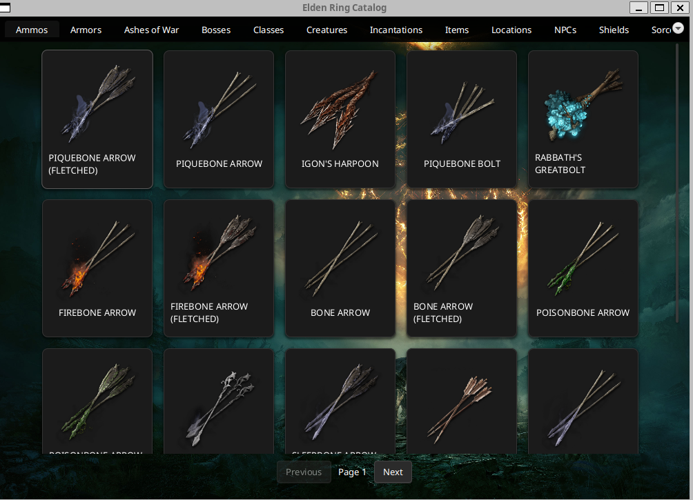

# Elden Ring Catalog

A JavaFX desktop application for browsing and exploring Elden Ring game items, including ammo, armor, ashes of war, and more. The application features a beautiful UI with background imagery from the game and uses web scraping to fetch real-time data from the Fextralife wiki.


*Browse through all armor sets in the game*


*Explore all Ashes of War with their icons*


*View all arrows and bolts available in the game*

## Features

### 📋 Multiple Item Categories
- **Ammos** - Arrows and Bolts with detailed stats
- **Armors** - Complete armor sets and pieces
- **Ashes of War** - All available ashes of war with icons
- **Bosses** - (Coming Soon)
- **Classes** - (Coming Soon)
- **Creatures** - (Coming Soon)
- **Incantations** - (Coming Soon)
- **Items** - (Coming Soon)
- **Locations** - (Coming Soon)
- **NPCs** - (Coming Soon)
- **Shields** - (Coming Soon)
- **Sorceries** - (Coming Soon)
- **Spirits** - (Coming Soon)
- **Talismans** - (Coming Soon)
- **Weapons** - (Coming Soon)

### 🎨 Beautiful UI
- Elden Ring themed background
- Card-based item display with images
- Smooth tab navigation
- Responsive pagination controls
- Loading and error states

### ⚡ Performance Features
- **Intelligent Caching** - Uses Caffeine cache to store scraped data (30-minute expiration)
- **Page-based Loading** - Loads 20 items at a time for fast rendering
- **Background Threading** - Non-blocking UI with background data fetching
- **Persistent Cache** - Survives tab switches without re-scraping

### 🔍 Web Scraping
- Real-time data extraction from [Fextralife Elden Ring Wiki](https://eldenring.wiki.fextralife.com/)
- Selenium WebDriver for dynamic content handling
- Robust error handling and retry logic
- Headless Chrome for efficient scraping

## Technology Stack

### Core Technologies
- **Java 11+** - Primary programming language
- **JavaFX** - UI framework for desktop application
- **Maven** - Dependency management and build tool

### Libraries & Frameworks
- **Selenium WebDriver** - Web scraping for dynamic content
- **Caffeine Cache** - High-performance caching library
- **ChromeDriver** - Browser automation for scraping

### Architecture Patterns
- **MVC Pattern** - Separation of concerns (Models, Services, Screens)
- **Factory Pattern** - Screen creation via ScreenFactory
- **Template Method Pattern** - BaseListScreen for common pagination logic
- **Singleton Pattern** - Shared cache instances across services
- **DRY Principles** - Minimal code duplication through inheritance

## Project Structure

```
elden-ring-catalog/
├── src/
│   ├── main/
│   │   ├── java/
│   │   │   └── eldenring/poc/
│   │   │       ├── MainApp.java              # Application entry point
│   │   │       ├── config/
│   │   │       │   └── ApiConfig.java        # Base URL configuration
│   │   │       ├── models/
│   │   │       │   ├── BaseModel.java        # Abstract base for all models
│   │   │       │   ├── Ammo.java             # Detailed ammo model
│   │   │       │   ├── AmmoBase.java         # Basic ammo info
│   │   │       │   ├── ArmorBase.java        # Basic armor info
│   │   │       │   ├── AshesOfWarBase.java   # Basic ash of war info
│   │   │       │   └── AttackPower.java      # Attack power stats
│   │   │       ├── navigation/
│   │   │       │   ├── AppNavigator.java     # Screen navigation manager
│   │   │       │   └── ScreenFactory.java    # Screen instantiation factory
│   │   │       ├── scrapers/
│   │   │       │   ├── BaseScraper.java      # Abstract scraper with WebDriver setup
│   │   │       │   ├── AmmoScraper.java      # Scrapes ammo data
│   │   │       │   ├── ArmorScraper.java     # Scrapes armor data
│   │   │       │   └── AshesOfWarScraper.java # Scrapes ashes of war data
│   │   │       ├── screens/
│   │   │       │   ├── BaseScreen.java       # Base UI components (pagination, cards)
│   │   │       │   ├── BaseListScreen.java   # Generic paginated list screen
│   │   │       │   ├── AmmoScreen.java       # Ammo listing screen
│   │   │       │   ├── AmmoDetailScreen.java # Detailed ammo view
│   │   │       │   ├── ArmorScreen.java      # Armor listing screen
│   │   │       │   └── AshesOfWarScreen.java # Ashes of War listing screen
│   │   │       └── services/
│   │   │           ├── AmmoService.java      # Ammo data service with caching
│   │   │           ├── ArmorService.java     # Armor data service with caching
│   │   │           └── AshesOfWarService.java # Ashes of War service with caching
│   │   └── resources/
│   │       ├── background.png                # Game background image
│   │       ├── styles.css                    # Main application styles
│   │       └── items.css                     # Item card styles
│   └── test/
│       └── java/                             # Unit tests (to be implemented)
├── pom.xml                                   # Maven configuration
└── README.md                                 # This file
```

## Architecture Overview

### Data Flow
```
User Interaction → Screen → Service → Cache Check
                                     ↓ (Cache Miss)
                                   Scraper → Web (Fextralife)
                                     ↓
                                   Cache Store
                                     ↓
                                   Display to User
```

### Class Hierarchy

#### Models
```
BaseModel (abstract)
  ├── AmmoBase
  ├── ArmorBase
  ├── AshesOfWarBase
  └── Ammo (extends AmmoBase with additional details)
```

#### Screens
```
BorderPane
  └── BaseScreen (abstract)
       └── BaseListScreen<T extends BaseModel> (generic)
            ├── AmmoScreen
            ├── ArmorScreen
            └── AshesOfWarScreen
```

#### Scrapers
```
BaseScraper (abstract)
  ├── AmmoScraper
  ├── ArmorScraper
  └── AshesOfWarScraper
```

## Getting Started

### Prerequisites
- **Java JDK 11 or higher**
- **Maven 3.6+**
- **Chrome Browser** (for Selenium WebDriver)
- **ChromeDriver** (automatically managed by Selenium)

### Installation

1. **Clone the repository**
   ```bash
   git clone <repository-url>
   cd elden-ring-catalog
   ```

2. **Build the project**
   ```bash
   mvn clean install
   ```

3. **Run the application**
   ```bash
   mvn javafx:run
   ```

   Or run the main class directly:
   ```bash
   java -cp target/classes eldenring.poc.MainApp
   ```

### Maven Dependencies

Key dependencies used in the project:

```xml
<dependencies>
    <!-- JavaFX -->
    <dependency>
        <groupId>org.openjfx</groupId>
        <artifactId>javafx-controls</artifactId>
        <version>17.0.2</version>
    </dependency>
    
    <!-- Selenium WebDriver -->
    <dependency>
        <groupId>org.seleniumhq.selenium</groupId>
        <artifactId>selenium-java</artifactId>
        <version>4.x.x</version>
    </dependency>
    
    <!-- Caffeine Cache -->
    <dependency>
        <groupId>com.github.ben-manes.caffeine</groupId>
        <artifactId>caffeine</artifactId>
        <version>3.x.x</version>
    </dependency>
</dependencies>
```

## Usage

### Browsing Items

1. **Launch the application** - The main window opens with multiple tabs
2. **Select a category** - Click on any tab (Ammos, Armors, Ashes of War, etc.)
3. **Browse items** - Scroll through the card-based gallery view
4. **Paginate** - Use "Previous" and "Next" buttons to navigate pages
5. **View details** - Click on an item card to see detailed information (for implemented categories)

### Navigation

- **Tab Selection** - Click any tab to switch categories
- **Page Navigation** - Use the pagination controls at the bottom
- **Item Details** - Click on item cards (Ammo currently supports detail view)

### Caching Behavior

- First load scrapes data from the web (may take a few seconds)
- Subsequent loads use cached data (instant)
- Cache expires after 30 minutes
- Cache persists when switching between tabs
- Maximum 100 pages cached per category

## Development

### Adding a New Category

To add a new item category (e.g., Weapons):

1. **Create the Model**
   ```java
   public class WeaponBase extends BaseModel {
       private String name;
       private String image;
       
       @Override
       public String getDisplayName() { return name; }
       
       @Override
       public String getImageUrl() { return image; }
   }
   ```

2. **Create the Scraper**
   ```java
   public class WeaponScraper extends BaseScraper {
       public List<WeaponBase> scrapeWeapons() {
           // Implement scraping logic
       }
   }
   ```

3. **Create the Service**
   ```java
   public class WeaponService {
       private static final Cache<String, Object> cache = 
           Caffeine.newBuilder()
               .expireAfterWrite(30, TimeUnit.MINUTES)
               .build();
       
       public List<WeaponBase> fetchWeapons(int limit, int page) {
           // Implement caching and pagination logic
       }
   }
   ```

4. **Create the Screen**
   ```java
   public class WeaponScreen extends BaseListScreen<WeaponBase> {
       private WeaponService service;
       
       public WeaponScreen(AppNavigator navigator) {
           super(navigator, LOGGER, "weapons");
       }
       
       @Override
       protected List<WeaponBase> fetchItems(int limit, int page) {
           if (service == null) service = new WeaponService();
           return service.fetchWeapons(limit, page);
       }
   }
   ```

5. **Register in ScreenFactory**
   ```java
   screenCreators.put("Weapons", nav -> new WeaponScreen(nav).getView());
   ```

## Known Limitations

- Web scraping depends on Fextralife wiki structure (may break if website changes)
- Rate limiting from source website may cause temporary failures
- Chrome browser required for scraping
- No offline mode (requires internet for initial data fetch)
- Limited to data available on Fextralife wiki

## Acknowledgments

- **FromSoftware** - For creating Elden Ring
- **Fextralife Community** - For maintaining the comprehensive wiki
- **JavaFX Community** - For the excellent UI framework
- **Selenium Project** - For web automation tools
- **Caffeine Cache** - For high-performance caching
---

**Note:** This is a fan-made project and is not affiliated with or endorsed by FromSoftware Inc. or Bandai Namco Entertainment.

